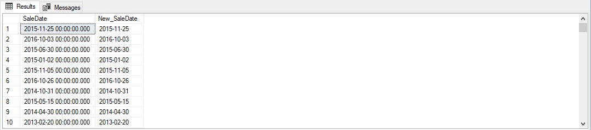
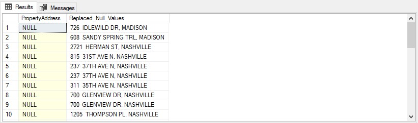

# Data Cleaning using SQL


## Introduction
The world today is data-driven hence, accurate, reliable, and high-quality data is of utmost importance for making informed business decisions. However, real-world data often comes with inconsistencies and errors, making it necessary to perform data cleaning to ensure data quality. This project aims to showcase a comprehensive data-cleaning effort utilizing SQL to tackle issues such as data standardization, missing values, and data validation.

## Project Overview
The data-cleaning project revolves around a relatively large dataset containing information about Housing in Nashville (a city in the U.S.). The data encompasses Property address, owner address, sales date, taxing, sale price, and various other relevant attributes. 

## Objectives
- Standardize entries: Convert the date field into the appropriate data format to ensure consistent and accurate entries.
- Identify and rectify missing values: Analyze the dataset to detect missing data points, and devise strategies to handle these gaps effectively.
- Split ambiguous fields for easy readability.
- Resolve inconsistencies: Identify and address data inconsistencies, such as variations in naming conventions or erroneous entries.
- Remove duplicates: Identify and eliminate duplicate records to avoid redundancy and prevent skewed analysis.
- Remove irrelevant columns from the dataset.
- Rename column headers.

## Data Sourcing
The Nashville Housing dataset was downloaded from GitHub. Click on this [link](https://github.com/AlexTheAnalyst/PortfolioProjects/blob/main/Nashville%20Housing%20Data%20for%20Data%20Cleaning.xlsx) to access the data.

## Procedures
After downloading the data (Excel worksheet),  I created a database and then, imported the dataset into MSSQL Server.

## Skills Demonstrated
- Converting data to different formats.
- Window Functions
- Using CTEs.
- Updating a table in the database.

## Data Cleaning Process
All the queries used for this project can be accessed [here](Data_Cleaning.sql)

### _Data Profiling_
Review the dataset's structure and columns.
```
SELECT * FROM [dbo].[Nashville_Data]`
```
The above query retrieves all the columns and rows in the dataset.
***

### _Standardize entries_
Change the date format from DateTime to Date. DateTime format displays both date and time while the Date format only displays the date. In this context, the time would have been useful except that it had 0s all through.

```
SELECT 
	SaleDate,
	CAST(SaleDate AS Date) AS New_SaleDate
FROM [dbo].[Nashville_Data]

ALTER TABLE Nashville_Data
ADD New_SaleDate Date;

UPDATE Nashville_Data
SET New_SaleDate = CAST(SaleDate AS Date)
```

***

### _Identify and rectify missing values_
Use SQL queries to identify columns with missing data. Apply the **ISNULL** function to handle missing values appropriately.
There are missing values in the property address field, so I discovered a consistent pattern in the data, that properties with the same parcelID have the same property address, thus I replace the null values with the addresses that have the same parcelID.

```
SELECT 
	tab1.ParcelID, 
	tab1.PropertyAddress, 
	tab2.ParcelID, 
	tab2.PropertyAddress,
	ISNULL(tab1.PropertyAddress, tab2.PropertyAddress) AS Replaced_Null_Values
FROM [dbo].[Nashville_Data] AS tab1
	JOIN [dbo].[Nashville_Data] AS tab2
		ON tab1.ParcelID = tab2.ParcelID
		AND tab1.[UniqueID ] != tab2.[UniqueID ]
WHERE tab1.PropertyAddress IS NULL 


UPDATE tab1
SET PropertyAddress = ISNULL(tab1.PropertyAddress, tab2.PropertyAddress)
FROM [dbo].[Nashville_Data] AS tab1
	JOIN [dbo].[Nashville_Data] AS tab2
		ON tab1.ParcelID = tab2.ParcelID
		AND tab1.[UniqueID ] != tab2.[UniqueID ]
WHERE tab1.PropertyAddress IS NULL 
```

***

### _Split ambiguous fields for easy readability_
The property address column encompasses the address and the city altogether. The same thing was also repeated with the owner's address which included the address, city, and state. With this information, one cannot clearly distinguish between them.
Utilize SQL functions (such as SUBSTRING, REPLACE, PARSENAME, CHARINDEX, ALTER, and UPDATE) to split the column into separate columns.
```
SELECT 
	SUBSTRING(PropertyAddress, 1, CHARINDEX(',', PropertyAddress)-1) AS Address,
	SUBSTRING(PropertyAddress, CHARINDEX(',', PropertyAddress)+1, LEN(PropertyAddress)) AS City
FROM [dbo].[Nashville_Data]


ALTER TABLE Nashville_Data
ADD PropertySplitAddress nvarchar(255);

UPDATE Nashville_Data
SET PropertySplitAddress = SUBSTRING(PropertyAddress, 1, CHARINDEX(',', PropertyAddress)-1)

ALTER TABLE Nashville_Data
ADD PropertySplitCity nvarchar(255);

UPDATE Nashville_Data
SET PropertySplitCity = SUBSTRING(PropertyAddress, CHARINDEX(',', PropertyAddress)+1, LEN(PropertyAddress))
```


##### _Splitting Owner Address into three columns (Address, City, State)_

```
SELECT 
	OwnerAddress,
	PARSENAME(REPLACE(OwnerAddress, ',', '.'),3) AS Address,
	PARSENAME(REPLACE(OwnerAddress, ',', '.'),2) AS City,
	PARSENAME(REPLACE(OwnerAddress, ',', '.'),1) AS State
FROM [dbo].[Nashville_Data]

ALTER TABLE Nashville_Data
ADD OwnerSplitAddress nvarchar(255);

UPDATE Nashville_Data
SET OwnerSplitAddress = PARSENAME(REPLACE(OwnerAddress, ',', '.'),3)

ALTER TABLE Nashville_Data
ADD OwnerSplitCity nvarchar(255);

UPDATE Nashville_Data
SET OwnerSplitCity = PARSENAME(REPLACE(OwnerAddress, ',', '.'),2)

ALTER TABLE Nashville_Data
ADD OwnerSplitState nvarchar(255);

UPDATE Nashville_Data
SET OwnerSplitState = PARSENAME(REPLACE(OwnerAddress, ',', '.'),1) 
```

***

### _Resolve Inconsistencies_
Use SQL Case Statement to correct inconsistent data entries.

```
SELECT
	CASE
		WHEN SoldAsVacant = 'N' THEN 'No'
		WHEN SoldAsVacant = 'Y' THEN 'Yes'
		ELSE SoldAsVacant
	END AS Replaced
FROM [dbo].[Nashville_Data]

UPDATE Nashville_Data
SET SoldAsVacant = CASE
					WHEN SoldAsVacant = 'N' THEN 'No'
					WHEN SoldAsVacant = 'Y' THEN 'Yes'
					ELSE SoldAsVacant
				 END
```

***

### _Remove duplicates_
Utilize SQL's CTE(Common Table Expressions), Window functions (ROW_NUMBER and PARTITION BY), and ORDER BY clause to identify duplicate records based on specific criteria. 

```
WITH cte_rownum AS (
SELECT 
	*,
	ROW_NUMBER() OVER(PARTITION BY ParcelID, PropertyAddress, SalePrice, New_SaleDate, LegalReference			
					ORDER BY UniqueID) AS row_numb
FROM [dbo].[Nashville_Data]
)
DELETE * FROM cte_rownum
WHERE row_numb > 1
```
***

### _Remove irrelevant columns from the dataset_
Since the property address, sale date, and owner's address were already replaced, it's only wise to remove them from our dataset to avoid having redundant data.
```
ALTER TABLE Nashville_Data
DROP COLUMN PropertyAddress, SaleDate, OwnerAddress
```
***

### _Rename column headers_
Renaming some columns' headers to more meaningful names.

```
EXEC sys.sp_rename 
    @objname = N'dbo.Nashville_Data.New_SaleDate', 
    @newname = 'SaleDate', 
    @objtype = 'COLUMN'

	EXEC sys.sp_rename 
    @objname = N'dbo.Nashville_Data.PropertySplitAddress', 
    @newname = 'PropertyAddress', 
    @objtype = 'COLUMN'

	EXEC sys.sp_rename 
    @objname = N'dbo.Nashville_Data.PropertySplitCity', 
    @newname = 'PropertyCity', 
    @objtype = 'COLUMN'

	EXEC sys.sp_rename 
    @objname = N'dbo.Nashville_Data.OwnerSplitAddress', 
    @newname = 'OwnerAddress', 
    @objtype = 'COLUMN'

	EXEC sys.sp_rename 
    @objname = N'dbo.Nashville_Data.OwnerSplitCity', 
    @newname = 'OwnerCity', 
    @objtype = 'COLUMN'

	EXEC sys.sp_rename 
    @objname = N'dbo.Nashville_Data.OwnerSplitState', 
    @newname = 'OwnerState', 
    @objtype = 'COLUMN'
```

****

### Conclusion
Through the application of SQL, this data-cleaning project successfully transformed a messy and unreliable dataset into a clean and consistent resource. By addressing missing values, duplicates, and inconsistencies, the dataset's quality significantly improved. The enhanced data quality ensures that the data is reliable and can be used for Data Analysis to inform decision-making, ultimately leading to more effective and accurate insights for Nashville Housing.
